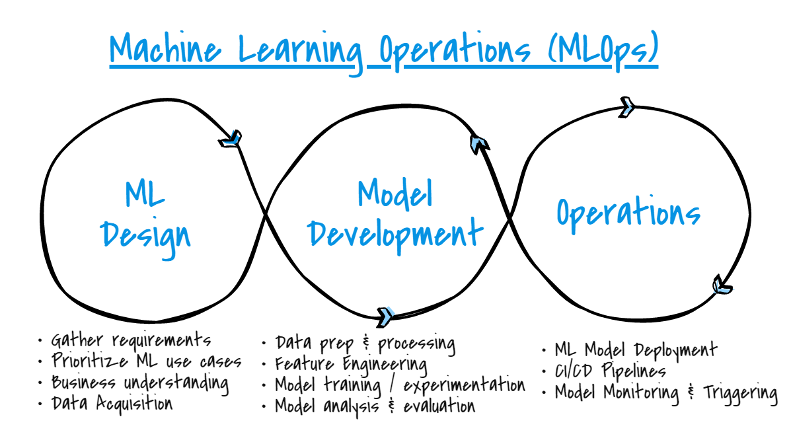

# Data Engineering, System Design, and ML Ops

## 1. Python + Data Engineering (Applied)

### Goal: Assess core data transformation skills. Use programming language of your choice for each part, applied to the sample data shared.

### Q1: Elasticsearch JSON Logs Processing

You receive JSON logs from an Elasticsearch stream. Implement the following:

- **Write a scalable (for volume) function** to read and parse the logs, extracting the `request timestamp` from the `createdDateTime`.
- **Create a function that generates model-ready features** (`day_of_year`, `day_of_week`, `hour_of_day`) for:
  - Model training (large volume of data processing, possibly millions of entries)
  - Real-time model inference with a focus on latency reduction

---
## Solution:
```scala
import java.nio.file.{Files, Paths}
import java.time.{Instant, ZoneId, ZonedDateTime}
import com.github.plokhotnyuk.jsoniter_scala.core._
import com.github.plokhotnyuk.jsoniter_scala.macros._

case class Source(createdDateTime: Long)
case class IndexRecord(_index: String, _source: Source)
case class TimeFeatures(dayOfYear: Int, dayOfWeek: Int, hourOfDay: Int)

object RealTimeJsonParser {
  implicit val sourceCodec: JsonValueCodec[Source] = JsonCodecMaker.make
  implicit val indexRecordCodec: JsonValueCodec[IndexRecord] = JsonCodecMaker.make
  implicit val indexRecordArrayCodec: JsonValueCodec[Array[IndexRecord]] = JsonCodecMaker.make

  def extractTimeFeatures(epochMillis: Long): TimeFeatures = {
    val instant = Instant.ofEpochMilli(epochMillis)
    val zdt = ZonedDateTime.ofInstant(instant, ZoneId.of("UTC"))
    TimeFeatures(
      dayOfYear = zdt.getDayOfYear,
      dayOfWeek = zdt.getDayOfWeek.getValue,
      hourOfDay = zdt.getHour
    )
  }
}

object Main {
  def main(args: Array[String]): Unit = {
    val inputJson = Files.readAllBytes(Paths.get("sample_sessions.json"))

    import RealTimeJsonParser._

    val records = readFromArray[Array[IndexRecord]](inputJson)

    records.foreach { rec =>
      val features = extractTimeFeatures(rec._source.createdDateTime)
      println(s"Extracted Features: $features")
    }
  }
}
```
### Scalability & Latency Considerations

- **Scalability**: Designed using stateless pure functions, can be integrated with Akka Streams or Flink for distributed ingestion.
- **Low Latency**: 
  - Uses `jsoniter-scala` which compiles codecs at runtime for high-speed JSON parsing (10–50x faster than traditional parsers like Jackson).
  - Avoids object-mapping overhead by directly parsing to case classes.
  - Minimal garbage generation = less GC pressure.

**Note**: Scala is chosen for its high-performance capabilities in data parsing, making it one of the fastest languages for this task.

[Click here](https://github.com/pkrishna1801/jsonlog-parser) for the Git repository.

## 2. System Design: Data Pipeline Architecture (Theoretical)

### Goal: Test your ability to design a robust data ingestion and serving system.

### Q2: Real-Time Data Pipeline Design for Clickstream Data

Design a real-time AWS-built data pipeline that:
- Ingests clickstream data from Elasticsearch
- Processes it
- Sends model-ready features to an ML model hosted behind a REST API

**Draw the architecture and explain:**
- Technologies used
- How you ensure latency < 100ms using features such as time of day, day of week, zip code of the request, aux data merged in based on zip code
- How you monitor failures

---

## Solution Design
### Real-Time AWS Data Pipeline for Clickstream Processing
This pipeline ingests clickstream data from Elasticsearch, processes it in real time, and sends model-ready features to an ML model hosted behind a REST API. It’s optimized for sub-100ms latency for an assumed traffic of 50k events per second.

---

## Pipeline Overview

Elasticsearch → Data Ingestion → Kinesis Data Streams → Stream Processing → Enrichment/Cache → Queue → ML API → Storage


.png)


CloudWatch is used throughout the pipeline for monitoring and alerting on all critical components to ensure system reliability and performance.


---

##  Component Breakdown

###  Elasticsearch → Custom Producer
A custom producer is used to extract data from Elasticsearch in real time. Unlike Logstash, which is more generic, this custom producer offers greater flexibility for high-throughput scenarios. It Supports JSON normalization, timestamp adjustments, and schema validation before sending to Kinesis

###  Custom Producer → Kinesis Data Streams
A fully managed and horizontally scalable stream ingestion service. Kinesis is responsible for ingesting and distributing the data in real time. It supports enhanced fan-out (EFO), which allows consumers like Flink to receive data with low latency and high throughput. This step serves as the primary ingestion buffer, providing ordering guarantees, durability, and built-in integration with downstream AWS analytics services.

### Kinesis Data Analytics (Flink)

Ingested data is then consumed by Kinesis Data Analytics, where Apache Flink jobs perform real-time processing. Flink is used here to extract and compute features such as hour of the day, day of the week, and session duration. It also handles event enrichment using metadata such as zip-code-based location or behavioral tags. The advantage of using Flink over Lambda or Kafka Streams lies in its powerful support for both stateless and stateful stream transformations, windowing, and dynamic joins. This allows the pipeline to remain responsive and accurate even under evolving data conditions.

### Redis (Lookup)

During stream processing in Flink, auxiliary data such as zip-code-to-region mappings or customer segments is fetched from Redis. Redis is chosen for its sub-millisecond response time, allowing Flink to perform lookups without compromising throughput or latency. Rather than persisting feature data in Redis, the system treats it purely as a fast, in-memory lookup table. This approach helps minimize state management within Flink

### Kinesis (Enriched) → Lambda
The processed events are written to a second Kinesis stream and consumed by an AWS Lambda function. Lambda is configured with batch processing enabled, which allows it to process groups of records efficiently. Within Lambda, additional tasks such as schema validation, field filtering, and transformation into the ML API’s input format are performed. It also handles retries, error logging, and asynchronous communication with the ML inference endpoint.

### ML REST API

###  Predictions → DynamoDB
Finally, the output from the ML API, including predictions and associated metadata, is written to DynamoDB. DynamoDB is selected for its ability to handle high write volumes with single-digit millisecond latency. It supports partitioning and indexing for efficient querying

Predictions and metadata are stored in DynamoDB for durability and downstream usage. It scales well with write-heavy workloads and provides fast querying capabilities. S3 was considered but is better suited for batch storage or archival purposes.

---

## Latency Estimates

| Step                          | Approx Latency |
| ----------------------------- | -------------- |
| Custom Producer → Kinesis     | \~5–10ms       |
| Kinesis → Flink               | \~10–20ms      |
| Redis lookup within Flink     | \~5ms          |
| Kinesis (Enriched) → Lambda   | \~5ms          |
| Lambda → ML API (batch)       | \~50ms         |
| API response → DynamoDB write | \~10ms         |
| **Total**                     | **\~85–95ms**  |


---

##  Monitoring and Failure Handling

- **CloudWatch** is configured to monitor:

  - Kinesis iterator age, shard health
  - Lambda duration, error rate, and throttles
  - Redis connection failures or latency spikes
  - API error rates and latencies
  - DynamoDB throttles or capacity issues

- **DLQ (Dead Letter Queue)** can be implemented at Flink, Lambda, and DynamoDB stages using Kinesis error streams, SQS queues, or S3 for failed record capture and replay.

- If Redis is temporarily unavailable, Kafka Streams can either fall back to cached data or flag the record for retry or DLQ.

---

## Alternatives Considered

| Component    | Used                 | Alternatives          | Rationale                                                                                   |
| ------------ | -------------------- | --------------------- | ------------------------------------------------------------------------------------------- |
| Ingestion    | Kinesis Data Streams | MSK (Kafka), SQS      | Kinesis is AWS-native, serverless, and easily scales with EFO for low latency               |
| Processing   | Flink on KDA         | Lambda, Kafka Streams | Flink handles stateful streaming + joins better than Lambda; no need for self-managed Kafka |
| Lookup Store | Redis                | DynamoDB              | Redis provides in-memory lookup performance critical for sub-100ms latency                  |
| Inference    | REST API (FastAPI)   | SageMaker Batch       | REST gives low-latency response; SageMaker batch adds delay and is better for async jobs    |
| Storage      | DynamoDB             | S3, Aurora            | DynamoDB offers single-digit ms write latency and scales easily                             |

---

##  Summary

This real-time, AWS-native architecture processes high-throughput clickstream data from Elasticsearch, enriches it with auxiliary data, performs fast inference, and logs results—all within ~90ms. It combines Kinesis, Flink, Redis, and Lambda for streaming, and uses DynamoDB for fast persistence. CloudWatch ensures visibility, while Redis lookups and batch Lambda processing help stay well within latency budgets.

The system is scalable, low-latency, and fault-tolerant, ready for production workloads up to 50,000 events/sec and beyond


# 3. ML Ops + Deployment (Theoretical)

### Goal: Evaluate deployment and ops strategy for ML services.

### Q3: Deploying Delivery-Date Prediction Model as API

You’ve trained a delivery-date prediction model in a Jupyter notebook. Describe the process of converting this model into a production API and implementing monitoring and versioning.

**Describe how you would:**
- Convert this into a production API (include tech stack)
- Monitor predictions and model drift
- Enable rollback and versioning


## Solution:

### Steps to Convert the Model into a Production-Ready API



1. the first step is to modularize the notebook code into reusable Python scripts, separating components like data preprocessing, model training, and inference.
2. FastAPI is an ideal choice for building the API due to its asynchronous capabilities and high performance.
3. The trained model should be logged, versioned, and packaged using MLflow, which also allows storing parameters, metrics, artifacts, and environments in a centralized model registry.
4. To load the correct version of the model during inference, the model can be dynamically retrieved using mlflow.metadata, which ensures compatibility and traceability.
5. To containerize the application, Docker can be used to bundle the code, model, and all dependencies. Separate environment setups should be maintained for development, staging, and production to isolate testing and deployment workflows.
6. For deployment,
   - a. Containerized Application can be hosted on Kubernetes cluster (EKS). This allows for easy scaling, management, and orchestration of the containers and can be hosted on cloud platforms like AWS or Azure.
   - b. An Application Load Balancer can be used route traffic to Kubernetes clusters efficiently and support auto-scaling, load balancing, and SSL termination.
   - c. Infrastructure provisioning and configuration can be managed using Terraform to ensure consistency and scalability across environments.
7. CI/CD pipelines, configured via GitHub Actions, should automate the build, test, and deployment process. These pipelines must include unit tests and integration tests to catch errors early and verify the functionality of the system before deployment.
8. Monitoring tools like AWS CloudWatch or Prometheus should be integrated to track API health, latency, and errors. Logs should be aggregated using tools like Fluentd or ELK stack for debugging and observability.

### Model Monitoring and Drift Detection

1. MLflow’s experiment tracking can be used to log all inputs, outputs, and model performance metrics such as MAE or RMSE.
2. In addition to MLflow, system-level monitoring can be implemented using tools like AWS CloudWatch or Azure Monitor to track service health, latency, and error rates.
3. Model drift detection can be done by comparing the distribution of incoming prediction data with training data using statistical metrics like Population Stability Index, or by monitoring performance degradation over time. Also we can write custom drift detection code (e.g., PSI) and log metrics to MLflow.
4. Alerts can be configured to notify the team if performance metrics deviate beyond thresholds, helping ensure model reliability in real-time usage.

### Rollback and Versioning Support

1. MLflow’s Model Registry can be used to manage multiple versions of the trained model, allowing promotion of a model to “Staging” or “Production” and easy rollback to any previous version.
2. Data and pipeline versioning can be handled using DVC, which tracks datasets and transformation scripts, enabling full reproducibility of any model training run.
3. All code changes can be maintained in a Git repository with release tags, and CI/CD pipelines can be configured to automate deployments, rollback procedures, and environment provisioning.

### Considered Alternative: Amazon SageMaker

SageMaker is not ideal for this use case due to:
- Limited customization, making Python frameworks like FastAPI a better choice for adding preprocessing or validation.
- High costs for continuous, lightweight predictions; containerized APIs (ECS Fargate, EC2, Azure App Services) offer better cost-performance.
- Tight integration with AWS-specific tools (e.g., Model Registry, Pipelines), limiting portability with tools like MLflow or DVC.
- Unpredictable cold start times and latency, which may violate SLA or real-time inference requirements.

SageMaker is better suited for large-scale training, A/B testing, or managed autoscaling with hundreds of models.
